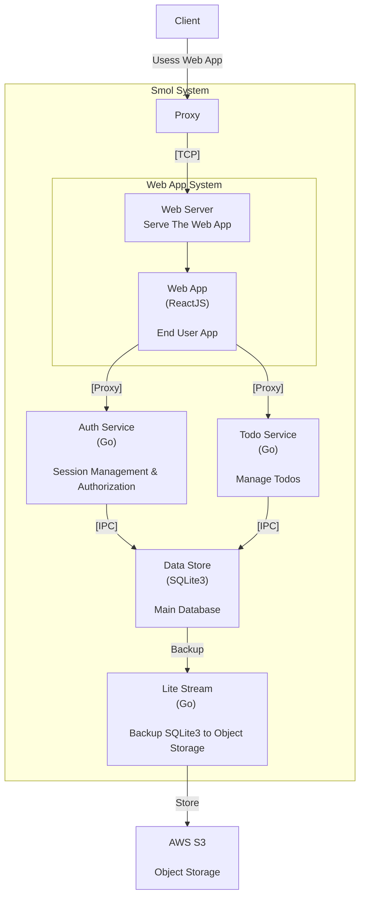

# Smol

Just a Smol Go Web Service

## Backend
- SQLite3
- router: chi
- sdk: oto
- authn
    - login: goth
        - [x] Google
    - session: scs
- authz: simple rbac
- proxy: Caddy

## Web App
- ReactJS Vite MPA
- Chakra UI

## System Overview

