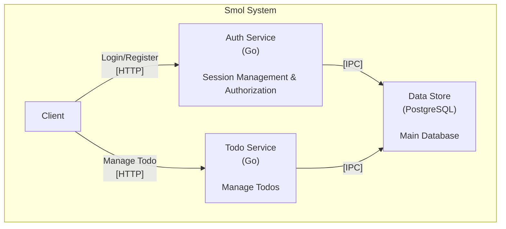

# Smol

Just a Smol Go Web Service

## Backend
- postgres with sqlc-pgx
- router: chi
- authn
    - login: goth
        - [x] Google
    - session: scs
- authz: simple rbac
- proxy: Caddy

## Framework Architecture

### System Overview
