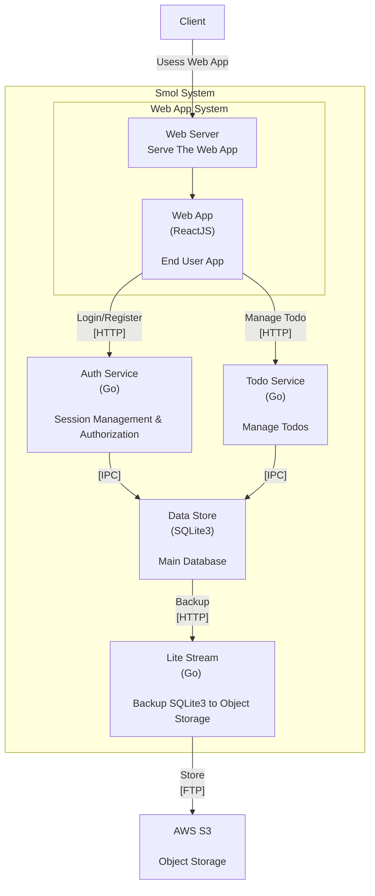

# Smol

Just a Smol Go Web Service

## Backend
- SQLite3
- router: chi
- sdk: oto
- authn
    - login: goth
        - [x] Google
    - session: scs
- authz: simple rbac
- proxy: Caddy

## Web App
- ReactJS Vite MPA
- Chakra UI

## Framework Architecture
This framework has two components: backend & web

The backend is a REST based Go app that uses [pacedotdev/oto](https://github.com/pacedotdev/oto) to generate the client SDK.
So far it really nice to have a TypeScript SDK to work with.

The web is a React Vite and has two components: SPA & SSG. The SPA are pages that the navigation is handled in client side.
The SSG are pages that pre-rendered during build time that use `vite-ssr-plugin`.

### Development
- In development mode, we need to add proxy before vite & Go
  - cuz, vite render the React on the fly and serve it directly to browser (no generated file)

### Production
- The SSG & SPA files will be served from Go. You need to attach each routes to the Go router in `backend/restapi/restapi.go`

### System Overview
