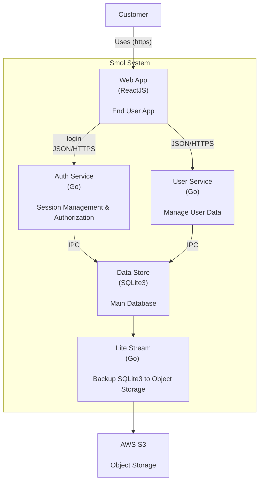

# Smol

Just a Smol Go Web Service

## System Overview

```mermaid
graph TB
    Customer--"Uses (https)"-->WebApp("Web App")
    subgraph "Smol System"
        WebApp["Web App<br>(ReactJS)<br><br>End User App"]
        AuthService["Auth Service<br>(Go)<br><br>Session Management & Authorization"]
        DataStore["Data Store<br> (SQLite3) <br><br> Main Database"]
        UserService["User Service<br>(Go) <br><br>Manage User Data"]
        LiteStream["Lite Stream<br>(Go) <br><br>Backup SQLite3 to Object Storage"]
        
        WebApp -- "login<br>JSON/HTTPS" --> AuthService -- "IPC" --> DataStore
        WebApp-- "JSON/HTTPS" --> UserService -- "IPC" --> DataStore --> LiteStream
    end
    LiteStream-->AWSS3["AWS S3 <br><br>Object Storage"]
```